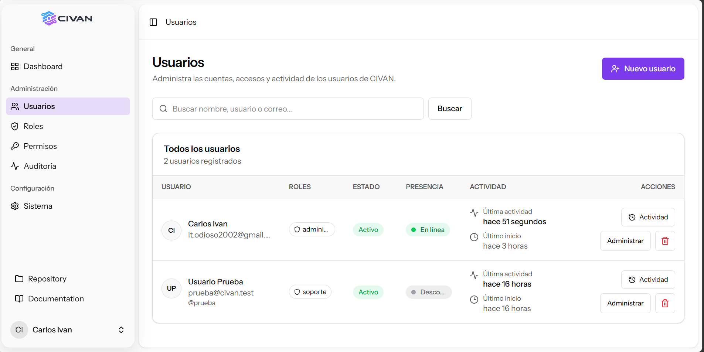

# CIVAN


Panel de administración desarrollado con **Laravel 12 + Inertia + React + TypeScript + Vite**.

CIVAN está orientado a la administración desde una interfaz web moderna. La versión actual incluye gestión de usuarios, roles y permisos, auditoría, configuración general del sistema, internacionalización Español/Inglés, personalización visual del panel y branding dinámico.

---

<p align="center">
  
</p>

<p align="center">
  <em>Vista del módulo de gestión de usuarios de CIVAN.</em>
</p>

# Tabla de contenido

1. [Características actuales](#características-actuales)
2. [Stack tecnológico](#stack-tecnológico)
3. [Requisitos del sistema](#requisitos-del-sistema)
4. [Extensiones de PHP necesarias](#extensiones-de-php-necesarias)
5. [Configuración recomendada de PHP](#configuración-recomendada-de-php)
6. [Instalación rápida para desarrollo](#instalación-rápida-para-desarrollo)
7. [Configuración del archivo `.env`](#configuración-del-archivo-env)
8. [Configuración de la base de datos](#configuración-de-la-base-de-datos)
9. [Migraciones y permisos](#migraciones-y-permisos)
10. [Crear el primer administrador](#crear-el-primer-administrador)
11. [Storage, logos y favicon](#storage-logos-y-favicon)
12. [Ejecutar CIVAN en desarrollo](#ejecutar-civan-en-desarrollo)
13. [Instalación en Windows con XAMPP](#instalación-en-windows-con-xampp)
14. [Instalación en Ubuntu Server](#instalación-en-ubuntu-server)
15. [Configuración de Nginx](#configuración-de-nginx)
16. [Despliegue en producción](#despliegue-en-producción)
17. [Scheduler de Laravel](#scheduler-de-laravel)
18. [Permisos de archivos en Linux](#permisos-de-archivos-en-linux)
19. [Configuración inicial dentro de CIVAN](#configuración-inicial-dentro-de-civan)
20. [Sistema de apariencia](#sistema-de-apariencia)
21. [Auditoría](#auditoría)
22. [Comandos útiles](#comandos-útiles)
23. [Solución de problemas](#solución-de-problemas)
24. [Checklist después de instalar](#checklist-después-de-instalar)
25. [Buenas prácticas para GitHub](#buenas-prácticas-para-github)

---

# Características actuales

La versión actual de CIVAN incluye:

- Dashboard administrativo.
- Gestión de usuarios.
- Creación y edición de usuarios.
- Estado de usuarios:
  - Activo.
  - Pendiente.
  - Suspendido.
- Seguimiento de presencia:
  - En línea.
  - Ausente.
  - Desconectado.
- Último inicio de sesión.
- Última actividad.
- Historial de actividad individual.
- Roles.
- Permisos.
- Integración con `spatie/laravel-permission`.
- Sincronización automática de permisos.
- Protección del rol `administrador`.
- Auditoría de acciones importantes.
- Registro de:
  - login;
  - logout;
  - creación;
  - actualización;
  - eliminación;
  - cambio de estado;
  - cambio de roles;
  - cambios de permisos;
  - navegación;
  - configuración;
  - exportaciones;
  - retención.
- Exportación de auditoría:
  - CSV;
  - Excel;
  - PDF.
- Retención configurable para eventos de navegación.
- Configuración general del sistema.
- Nombre dinámico del panel.
- Nombre corto.
- Zona horaria configurable.
- Formato de fecha.
- Formato de hora.
- Registros por página.
- Idiomas:
  - Español;
  - English.
- Personalización de apariencia:
  - color principal;
  - color del sidebar;
  - sidebar normal o redondeado;
  - fondo global;
  - color de cards;
  - cards sólidas;
  - Glassmorphism.
- Branding:
  - logo para modo claro;
  - logo para modo oscuro;
  - favicon;
  - tamaño configurable del logo.
- Favicon dinámico.
- Logo adaptativo según apariencia clara/oscura.
- Diseño responsive.

---

# Stack tecnológico

## Backend

- PHP `>= 8.2`
- Laravel 12
- MySQL o MariaDB
- Spatie Laravel Permission
- PhpSpreadsheet
- DomPDF

## Frontend

- React
- TypeScript
- Inertia.js
- Vite
- Tailwind CSS
- componentes estilo shadcn/ui
- Lucide Icons

## Herramientas

- Composer
- Node.js
- npm
- Git

---

# Requisitos del sistema

## Requisitos mínimos recomendados para desarrollo

| Recurso | Recomendación |
|---|---|
| CPU | 2 núcleos |
| RAM | 4 GB |
| Espacio libre | 2 GB o más |
| PHP | 8.2 o superior |
| Composer | 2.x |
| Node.js | 20 o superior recomendado |
| npm | incluido con Node.js |
| Base de datos | MySQL 8+ o MariaDB equivalente |
| Git | versión reciente |

Para producción se recomienda:

- 2 o más CPU;
- 4 GB o más de RAM;
- SSD;
- Nginx o Apache;
- PHP-FPM;
- base de datos separada o correctamente respaldada;
- HTTPS.

---

# Extensiones de PHP necesarias

CIVAN necesita las extensiones habituales de Laravel y algunas adicionales utilizadas por Excel, PDF, imágenes y uploads.

Verifica:

```bash
php -m
```

Se recomienda tener habilitadas:

```text
bcmath
ctype
curl
dom
fileinfo
filter
gd
iconv
intl
json
mbstring
openssl
pdo
pdo_mysql
session
simplexml
tokenizer
xml
xmlreader
xmlwriter
zip
```

Las más importantes para este proyecto son:

```text
pdo_mysql
mbstring
xml
curl
zip
gd
fileinfo
bcmath
```

## Verificar una extensión concreta

Ejemplo:

```bash
php -m | grep gd
```

En Windows:

```powershell
php -m | findstr gd
```

---

# Configuración recomendada de PHP

CIVAN permite subir logos de hasta aproximadamente 5 MB. Por eso PHP debe permitir requests suficientemente grandes.

Busca tu archivo:

```bash
php --ini
```

Edita `php.ini` y verifica:

```ini
memory_limit = 256M
upload_max_filesize = 8M
post_max_size = 16M
max_execution_time = 120
max_input_time = 120
```

Después reinicia PHP/Apache/Nginx según tu entorno.

## XAMPP

Reinicia Apache desde el panel de XAMPP.

## Ubuntu con PHP-FPM

Ejemplo:

```bash
sudo systemctl restart php8.3-fpm
sudo systemctl restart nginx
```

Ajusta `8.3` a la versión instalada en el servidor.

---

# Instalación rápida para desarrollo

## 1. Clonar el repositorio

```bash
https://github.com/igCarlos/civan.git
cd civan
```

Si ya descargaste el ZIP:

```bash
cd ruta/al/proyecto/civan
```

---

## 2. Instalar dependencias de PHP

```bash
composer install
```

En producción se recomienda:

```bash
composer install --no-dev --optimize-autoloader
```

Si Composer informa que falta una extensión PHP, instala/habilita esa extensión antes de continuar.

---

## 3. Instalar dependencias de frontend

Si existe `package-lock.json`, lo ideal es:

```bash
npm ci
```

Si no existe:

```bash
npm install
```

---

## 4. Crear `.env`

Linux/macOS:

```bash
cp .env.example .env
```

Windows PowerShell:

```powershell
Copy-Item .env.example .env
```

Windows CMD:

```cmd
copy .env.example .env
```

---

## 5. Generar la clave de Laravel

```bash
php artisan key:generate
```

Debe aparecer:

```text
Application key set successfully.
```

---

# Configuración del archivo `.env`

Ejemplo recomendado para desarrollo:

```env
APP_NAME=CIVAN
APP_ENV=local
APP_KEY=
APP_DEBUG=true
APP_URL=http://localhost:8000

APP_LOCALE=es
APP_FALLBACK_LOCALE=en
APP_FAKER_LOCALE=es_ES

LOG_CHANNEL=stack
LOG_LEVEL=debug

DB_CONNECTION=mysql
DB_HOST=127.0.0.1
DB_PORT=3306
DB_DATABASE=civan
DB_USERNAME=root
DB_PASSWORD=

SESSION_DRIVER=file
SESSION_LIFETIME=120

CACHE_STORE=file

QUEUE_CONNECTION=sync

FILESYSTEM_DISK=local
```

> Después de ejecutar `php artisan key:generate`, Laravel llenará `APP_KEY`.

## Producción

En producción:

```env
APP_ENV=production
APP_DEBUG=false
APP_URL=https://panel.tudominio.com
```

Nunca dejes:

```env
APP_DEBUG=true
```

en un servidor público.

---

# Configuración de la base de datos

## MySQL

Entra a MySQL:

```bash
mysql -u root -p
```

Crear base de datos:

```sql
CREATE DATABASE civan
CHARACTER SET utf8mb4
COLLATE utf8mb4_unicode_ci;
```

Crear usuario recomendado para producción:

```sql
CREATE USER 'civan'@'localhost'
IDENTIFIED BY 'CAMBIA_ESTA_CONTRASENA';
```

Dar permisos:

```sql
GRANT ALL PRIVILEGES
ON civan.*
TO 'civan'@'localhost';
```

Aplicar:

```sql
FLUSH PRIVILEGES;
```

Salir:

```sql
EXIT;
```

En `.env`:

```env
DB_CONNECTION=mysql
DB_HOST=127.0.0.1
DB_PORT=3306
DB_DATABASE=civan
DB_USERNAME=civan
DB_PASSWORD=CAMBIA_ESTA_CONTRASENA
```

## Comprobar conexión

```bash
php artisan migrate:status
```

Si Laravel puede acceder a MySQL, mostrará el estado de las migraciones.

---

# Migraciones y permisos

## 1. Ejecutar migraciones

```bash
php artisan migrate
```

En producción:

```bash
php artisan migrate --force
```

---

## 2. Limpiar caché antes de sincronizar permisos

```bash
php artisan optimize:clear
```

---

## 3. Sincronizar permisos del proyecto

CIVAN dispone de sincronización automática de permisos por modelos.

Ejecuta:

```bash
php artisan permissions:sync-models --force
```

Si estás utilizando el paquete propio de permisos del proyecto y sus comandos están registrados, también pueden estar disponibles:

```bash
php artisan table-permissions:install --migrate
```

y para restaurar el administrador:

```bash
php artisan table-permissions:restore
```

Puedes comprobar qué comandos existen con:

```bash
php artisan list
```

Busca:

```text
permissions
table-permissions
```

> No ejecutes comandos que no aparezcan en `php artisan list`.

---

# Crear el primer administrador

Si tu instalación todavía no tiene usuarios, puedes crear uno desde Tinker.

```bash
php artisan tinker
```

Dentro de Tinker:

```php
use App\Models\User;
use Illuminate\Support\Facades\Hash;

$user = User::create([
    'name' => 'Administrador',
    'username' => 'admin',
    'email' => 'admin@example.com',
    'status' => 'active',
    'password' => Hash::make('CAMBIA_ESTA_CONTRASENA'),
]);
```

Asignar el rol administrador:

```php
$user->assignRole('administrador');
```

Salir:

```php
exit
```

Si todavía no existe el rol:

```php
use Spatie\Permission\Models\Role;

Role::firstOrCreate([
    'name' => 'administrador',
    'guard_name' => 'web',
]);
```

Luego:

```php
$user->assignRole('administrador');
```

## Importante

Cambia inmediatamente:

```text
admin@example.com
CAMBIA_ESTA_CONTRASENA
```

por credenciales seguras.

---

# Storage, logos y favicon

CIVAN permite subir:

- logo para modo claro;
- logo para modo oscuro;
- favicon.

Los archivos se almacenan en:

```text
storage/app/public/branding/
```

Por ejemplo:

```text
storage/app/public/
└── branding/
    ├── logos/
    └── favicon/
```

Para que el navegador pueda acceder a ellos debes crear el enlace simbólico:

```bash
php artisan storage:link
```

Esto crea:

```text
public/storage
→ storage/app/public
```

## Verificar

Comprueba que exista:

```text
public/storage
```

## Windows

Si Windows no permite crear el enlace simbólico:

1. abre la terminal como administrador;
2. o activa **Developer Mode** de Windows;
3. ejecuta nuevamente:

```powershell
php artisan storage:link
```

## Formatos de branding

### Logos

Permitidos:

```text
PNG
JPG
JPEG
WEBP
```

Tamaño máximo configurado:

```text
5 MB
```

Recomendación:

- fondo transparente;
- formato PNG/WebP;
- logo horizontal.

### Favicon

Permitidos:

```text
PNG
JPG
JPEG
WEBP
ICO
```

Tamaño máximo:

```text
2 MB
```

Recomendado:

```text
32x32
64x64
128x128
```

---

# Ejecutar CIVAN en desarrollo

Se necesitan dos procesos durante desarrollo.

## Terminal 1 - Laravel

```bash
php artisan serve
```

Por defecto:

```text
http://127.0.0.1:8000
```

o:

```text
http://localhost:8000
```

## Terminal 2 - Vite

```bash
npm run dev
```

Mantén ambas terminales abiertas.

---

# Instalación en Windows con XAMPP

Ejemplo de ubicación:

```text
C:\xampp\htdocs\civan
```

## 1. Verificar PHP

```powershell
php -v
```

Debe ser PHP 8.2 o superior.

Si PowerShell utiliza otro PHP diferente al de XAMPP:

```powershell
where.exe php
```

Puedes añadir:

```text
C:\xampp\php
```

al `PATH`.

---

## 2. Habilitar extensiones

Abre:

```text
C:\xampp\php\php.ini
```

Comprueba extensiones como:

```ini
extension=curl
extension=fileinfo
extension=gd
extension=mbstring
extension=mysqli
extension=pdo_mysql
extension=openssl
extension=zip
```

Dependiendo de XAMPP, algunas pueden aparecer sin prefijo `extension=` o ya estar activas.

Reinicia Apache después de modificar `php.ini`.

---

## 3. Crear base de datos

Desde phpMyAdmin:

```text
http://localhost/phpmyadmin
```

Crea:

```text
civan
```

con collation:

```text
utf8mb4_unicode_ci
```

---

## 4. Instalar proyecto

```powershell
cd C:\xampp\htdocs\civan

composer install
npm install

Copy-Item .env.example .env

php artisan key:generate
php artisan migrate
php artisan storage:link
php artisan permissions:sync-models --force
php artisan optimize:clear
```

---

## 5. Iniciar

Terminal 1:

```powershell
php artisan serve
```

Terminal 2:

```powershell
npm run dev
```

---

# Instalación en Ubuntu Server

## 1. Actualizar sistema

```bash
sudo apt update
sudo apt upgrade -y
```

---

## 2. Instalar herramientas

```bash
sudo apt install -y \
    nginx \
    mysql-server \
    git \
    curl \
    unzip
```

---

## 3. Instalar PHP y extensiones

Instala PHP 8.2 o superior.

Ejemplo con PHP 8.3:

```bash
sudo apt install -y \
    php8.3-cli \
    php8.3-fpm \
    php8.3-mysql \
    php8.3-mbstring \
    php8.3-xml \
    php8.3-curl \
    php8.3-zip \
    php8.3-gd \
    php8.3-bcmath \
    php8.3-intl
```

Verifica:

```bash
php -v
```

y:

```bash
php -m
```

---

## 4. Instalar Composer

Comprueba primero:

```bash
composer --version
```

Si Composer no está instalado, instálalo usando el procedimiento oficial de Composer para tu servidor.

Después:

```bash
composer --version
```

---

## 5. Instalar Node.js y npm

Verifica:

```bash
node -v
npm -v
```

Se recomienda Node.js 20 o superior compatible con las dependencias del proyecto.

---

## 6. Clonar CIVAN

Ejemplo:

```bash
cd /var/www
sudo git clone https://github.com/igCarlos/civan.git
sudo chown -R $USER:$USER /var/www/civan
cd /var/www/civan
```

---

## 7. Instalar dependencias

```bash
composer install
npm ci
```

Si no existe `package-lock.json`:

```bash
npm install
```

---

## 8. Preparar `.env`

```bash
cp .env.example .env
nano .env
```

Configura:

```env
APP_NAME=CIVAN
APP_ENV=production
APP_DEBUG=false
APP_URL=https://panel.tudominio.com

DB_CONNECTION=mysql
DB_HOST=127.0.0.1
DB_PORT=3306
DB_DATABASE=civan
DB_USERNAME=civan
DB_PASSWORD=CONTRASENA_SEGURA
```

---

## 9. Generar clave

```bash
php artisan key:generate
```

---

## 10. Migraciones

```bash
php artisan migrate --force
```

---

## 11. Permisos de CIVAN

```bash
php artisan permissions:sync-models --force
```

---

## 12. Storage

```bash
php artisan storage:link
```

---

## 13. Compilar frontend

```bash
npm run build
```

Esto generará los assets de producción de Vite.

---

# Configuración de Nginx

Ejemplo:

```nginx
server {
    listen 80;
    listen [::]:80;

    server_name panel.tudominio.com;

    root /var/www/civan/public;
    index index.php index.html;

    charset utf-8;

    client_max_body_size 16M;

    location / {
        try_files $uri $uri/ /index.php?$query_string;
    }

    location = /favicon.ico {
        access_log off;
        log_not_found off;
    }

    location = /robots.txt {
        access_log off;
        log_not_found off;
    }

    error_page 404 /index.php;

    location ~ \.php$ {
        include snippets/fastcgi-php.conf;

        fastcgi_pass unix:/run/php/php8.3-fpm.sock;
    }

    location ~ /\.(?!well-known).* {
        deny all;
    }
}
```

Guarda, por ejemplo:

```text
/etc/nginx/sites-available/civan
```

Crear enlace:

```bash
sudo ln -s /etc/nginx/sites-available/civan \
    /etc/nginx/sites-enabled/civan
```

Comprobar sintaxis:

```bash
sudo nginx -t
```

Reiniciar:

```bash
sudo systemctl reload nginx
```

## Importante

La raíz debe apuntar a:

```text
/var/www/civan/public
```

Nunca a:

```text
/var/www/civan
```

---

# Despliegue en producción

Procedimiento recomendado después de cada actualización:

```bash
cd /var/www/civan
```

Actualizar código:

```bash
git pull
```

Instalar dependencias PHP:

```bash
composer install \
    --no-dev \
    --optimize-autoloader
```

Instalar frontend:

```bash
npm ci
```

Compilar:

```bash
npm run build
```

Aplicar migraciones:

```bash
php artisan migrate --force
```

Limpiar caché anterior:

```bash
php artisan optimize:clear
```

Generar cachés de producción:

```bash
php artisan config:cache
php artisan route:cache
php artisan view:cache
```

Si modificaste permisos:

```bash
php artisan permissions:sync-models --force
```

Revisar:

```bash
php artisan about
```

---

# Scheduler de Laravel

CIVAN utiliza tareas programadas para procesos como la limpieza/retención de auditoría.

En Linux agrega al cron:

```bash
crontab -e
```

Añade:

```cron
* * * * * cd /var/www/civan && php artisan schedule:run >> /dev/null 2>&1
```

Laravel ejecutará internamente cada tarea en el momento correspondiente.

## Ver tareas configuradas

```bash
php artisan schedule:list
```

La retención de auditoría puede configurarse para limpiar eventos antiguos de navegación, manteniendo eventos importantes.

---

# Permisos de archivos en Linux

Laravel necesita escribir en:

```text
storage
bootstrap/cache
```

Configura:

```bash
sudo chown -R www-data:www-data \
    /var/www/civan/storage \
    /var/www/civan/bootstrap/cache
```

Luego:

```bash
sudo chmod -R 775 \
    /var/www/civan/storage \
    /var/www/civan/bootstrap/cache
```

Si utilizas un usuario de despliegue diferente, ajusta propietario/grupo según tu servidor.

---

# Configuración inicial dentro de CIVAN

Después de iniciar sesión como administrador:

```text
Configuración
└── Sistema
```

Configura:

## Identidad

- Nombre del panel.
- Nombre corto.

## Branding

- Logo modo claro.
- Logo modo oscuro.
- Favicon.
- Tamaño del logo.

## Regional

- Zona horaria.
- Idioma.
- Registros por página.
- Formato de fecha.
- Formato de hora.

## Apariencia

- Color principal.
- Color del sidebar.
- Forma del sidebar.
- Fondo.
- Color de cards.
- Estilo de cards.

---

# Sistema de apariencia

La configuración visual se almacena en `system_settings`.

Ejemplos de claves:

```text
system.panel_name
system.short_name

system.logo_light
system.logo_dark
system.favicon
system.logo_size

system.primary_color

system.sidebar_color
system.sidebar_shape

system.background_color_mode
system.background_color

system.card_color_mode
system.card_color
system.card_style

system.timezone
system.locale
system.date_format
system.time_format
system.per_page
```

## Sidebar

Forma:

```text
normal
rounded
```

## Fondo

Modo:

```text
auto
custom
```

## Cards

Modo de color:

```text
auto
custom
```

Estilo:

```text
solid
glass
```

`glass` activa el efecto Glassmorphism.

---

# Auditoría

CIVAN registra acciones administrativas importantes.

Entre los eventos actuales:

```text
login
logout
create
update
delete
role_change
status_change
permission_change
permission_sync
audit_export
audit_prune
audit_retention_update
page_view
system_settings_update
```

Los logs almacenan información como:

- actor;
- evento;
- módulo;
- descripción;
- valores anteriores;
- valores nuevos;
- IP;
- método HTTP;
- ruta;
- URL;
- user-agent;
- fecha.

## Privacidad

Antes de almacenar auditoría, los datos sensibles deben pasar por el sistema de sanitización de `AuditService`.

Nunca registres:

```text
password
password_confirmation
tokens
secret keys
API secrets
```

---

# Comandos útiles

## Información de Laravel

```bash
php artisan about
```

---

## Limpiar caché completa

```bash
php artisan optimize:clear
```

---

## Cache de producción

```bash
php artisan config:cache
php artisan route:cache
php artisan view:cache
```

---

## Ver rutas

```bash
php artisan route:list
```

Solo configuración:

```bash
php artisan route:list --path=configuracion
```

---

## Ver migraciones

```bash
php artisan migrate:status
```

---

## Ejecutar migraciones

```bash
php artisan migrate
```

---

## Rollback de la última migración

```bash
php artisan migrate:rollback
```

Úsalo con cuidado en producción.

---

## Sincronizar permisos

```bash
php artisan permissions:sync-models --force
```

---

## Storage link

```bash
php artisan storage:link
```

---

## Ver scheduler

```bash
php artisan schedule:list
```

---

## Iniciar servidor local

```bash
php artisan serve
```

---

## Vite desarrollo

```bash
npm run dev
```

---

## Build frontend

```bash
npm run build
```

---

## Revisar PHP

```bash
php -v
php -m
php --ini
```

---

## Revisar Node/npm

```bash
node -v
npm -v
```

---

## Revisar Composer

```bash
composer --version
```

---

# Solución de problemas

## Pantalla blanca o interfaz sin estilos

Ejecuta:

```bash
npm install
npm run dev
```

En producción:

```bash
npm run build
```

Después:

```bash
php artisan optimize:clear
```

---

## Error `Vite manifest not found`

No se ha generado el frontend de producción.

Ejecuta:

```bash
npm run build
```

---

## Error de conexión a MySQL

Ejemplo:

```text
SQLSTATE[HY000] [1045] Access denied
```

Comprueba:

```env
DB_HOST
DB_PORT
DB_DATABASE
DB_USERNAME
DB_PASSWORD
```

Después:

```bash
php artisan config:clear
```

---

## `Unknown database`

Crea primero la base:

```sql
CREATE DATABASE civan
CHARACTER SET utf8mb4
COLLATE utf8mb4_unicode_ci;
```

---

## Cambié `.env` pero Laravel sigue usando datos anteriores

```bash
php artisan optimize:clear
```

---

## Logo o favicon se guarda pero no aparece

Comprueba:

```bash
php artisan storage:link
```

Debe existir:

```text
public/storage
```

Comprueba también que `APP_URL` sea correcto.

---

## El formulario de configuración no guarda

Verifica la ruta:

```bash
php artisan route:list --path=configuracion/sistema
```

La configuración con archivos debe disponer de una ruta POST para recibir `multipart/form-data`.

Ejemplo esperado:

```text
GET|HEAD  dashboard/configuracion/sistema
POST      dashboard/configuracion/sistema
```

Después:

```bash
php artisan optimize:clear
```

---

## Error al subir logos

Comprueba `php.ini`:

```ini
upload_max_filesize = 8M
post_max_size = 16M
```

Reinicia PHP/Apache.

---

## Error 403 en Usuarios/Roles/Permisos

El usuario probablemente no tiene el permiso necesario.

Sincroniza:

```bash
php artisan permissions:sync-models --force
```

Luego limpia caché de permisos/aplicación:

```bash
php artisan optimize:clear
```

Comprueba el rol:

```bash
php artisan tinker
```

```php
$user = App\Models\User::find(1);

$user->getRoleNames();

$user->getAllPermissions()->pluck('name');
```

---

## Los permisos nuevos no aparecen

```bash
php artisan permissions:sync-models --force
```

---

## La hora aparece adelantada o atrasada

Mantén como base una configuración segura del servidor y luego configura desde:

```text
Configuración → Sistema → Regional → Zona horaria
```

Por ejemplo:

```text
America/Managua
```

Evita cambiar manualmente timestamps almacenados en la base de datos.

---

## El sidebar o colores vuelven al recargar

Comprueba que:

- `SystemSettingsService` comparte las configuraciones;
- `HandleInertiaRequests` comparte la prop `system`;
- `app.tsx` llama a `applySystemAppearance()` con la configuración inicial;
- los valores existan en `system_settings`.

Puedes revisar:

```bash
php artisan tinker
```

```php
App\Models\SystemSetting::where(
    'group',
    'system'
)->get([
    'key',
    'value',
]);
```

---

## Error de permisos en `storage`

Linux:

```bash
sudo chown -R www-data:www-data storage bootstrap/cache
sudo chmod -R 775 storage bootstrap/cache
```

---

## Error 500

Revisa:

```text
storage/logs/laravel.log
```

En Linux:

```bash
tail -f storage/logs/laravel.log
```

Luego reproduce el error.

---

# Checklist después de instalar

Comprueba uno por uno:

- [ ] `composer install` completado.
- [ ] `npm install` o `npm ci` completado.
- [ ] `.env` creado.
- [ ] `APP_KEY` generado.
- [ ] MySQL conectado.
- [ ] Migraciones ejecutadas.
- [ ] Permisos sincronizados.
- [ ] Administrador creado.
- [ ] `storage:link` creado.
- [ ] `storage` tiene permisos de escritura.
- [ ] Vite funciona.
- [ ] Laravel inicia.
- [ ] Login funciona.
- [ ] Usuarios abre.
- [ ] Roles abre.
- [ ] Permisos abre.
- [ ] Auditoría abre.
- [ ] Configuración del sistema guarda.
- [ ] Idioma Español/Inglés cambia correctamente.
- [ ] Zona horaria funciona.
- [ ] Color principal permanece después de recargar.
- [ ] Sidebar permanece después de recargar.
- [ ] Fondo permanece después de recargar.
- [ ] Cards permanecen después de recargar.
- [ ] Glassmorphism funciona.
- [ ] Logo modo claro aparece.
- [ ] Logo modo oscuro aparece.
- [ ] Favicon aparece.
- [ ] Tamaño del logo permanece después de recargar.
- [ ] Build de producción se genera correctamente.

---

# Buenas prácticas para GitHub

## No subir secretos

Nunca publiques:

```text
.env
```

Asegúrate de tener:

```gitignore
.env
.env.*
!.env.example
```

---

## No subir dependencias

Normalmente deben estar ignoradas:

```text
/vendor
/node_modules
```

Los usuarios las reconstruyen con:

```bash
composer install
npm install
```

---

## Sí subir locks

Se recomienda versionar:

```text
composer.lock
package-lock.json
```

Esto ayuda a que todos instalen las mismas versiones de dependencias.

---

## No subir uploads del usuario

El contenido dinámico de:

```text
storage/app/public
```

no debería utilizar Git como sistema de almacenamiento.

Los logos/favicon configurados en una instalación pertenecen a esa instalación.

---

## Mantener `.env.example`

Incluye únicamente valores de ejemplo:

```env
APP_NAME=CIVAN
APP_ENV=local
APP_KEY=
APP_DEBUG=true
APP_URL=http://localhost:8000

DB_CONNECTION=mysql
DB_HOST=127.0.0.1
DB_PORT=3306
DB_DATABASE=civan
DB_USERNAME=root
DB_PASSWORD=
```

Nunca pongas contraseñas reales.

---

# Estructura general importante

```text
civan/
├── app/
│   ├── Http/
│   ├── Models/
│   ├── Services/
│   └── ...
│
├── bootstrap/
│
├── config/
│
├── database/
│   ├── migrations/
│   └── seeders/
│
├── public/
│
├── resources/
│   ├── css/
│   ├── js/
│   │   ├── components/
│   │   ├── hooks/
│   │   ├── i18n/
│   │   ├── layouts/
│   │   ├── lib/
│   │   └── pages/
│   └── views/
│
├── routes/
│
├── storage/
│
├── tests/
│
├── .env.example
├── artisan
├── composer.json
├── composer.lock
├── package.json
├── package-lock.json
└── vite.config.ts
```

---

# Instalación resumida

Para una instalación local limpia:

```bash
git clone https://github.com/igCarlos/civan.git
cd civan

composer install
npm install

cp .env.example .env

php artisan key:generate

# Configurar MySQL en .env

php artisan migrate
php artisan storage:link
php artisan permissions:sync-models --force

php artisan optimize:clear
```

Terminal 1:

```bash
php artisan serve
```

Terminal 2:

```bash
npm run dev
```

Abrir:

```text
http://localhost:8000
```

---

# Instalación resumida de producción

```bash
git clone https://github.com/igCarlos/civan.git /var/www/civan

cd /var/www/civan

composer install \
    --no-dev \
    --optimize-autoloader

npm ci
npm run build

cp .env.example .env

php artisan key:generate

# Configurar .env

php artisan migrate --force
php artisan storage:link
php artisan permissions:sync-models --force

php artisan optimize:clear
php artisan config:cache
php artisan route:cache
php artisan view:cache
```

Configura Nginx apuntando a:

```text
/var/www/civan/public
```

y agrega el scheduler:

```cron
* * * * * cd /var/www/civan && php artisan schedule:run >> /dev/null 2>&1
```

---

# Nota final

Antes de publicar una nueva versión de CIVAN verifica siempre:

```bash
composer install
npm ci
php artisan migrate:status
php artisan route:list
php artisan permissions:sync-models --force
npm run build
php artisan optimize:clear
```

Si todos los comandos terminan sin errores, la instalación está preparada para ejecutarse correctamente.

---

**CIVAN** — Panel de administración.
